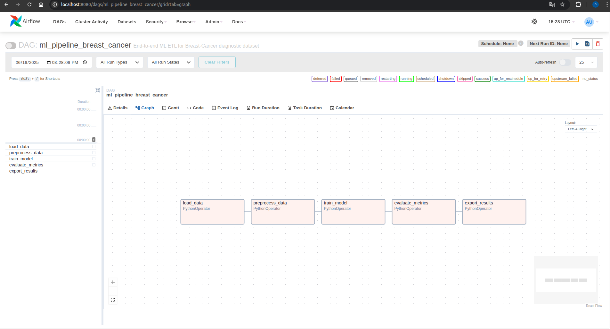

# Breast‑Cancer Diagnostic ML Pipeline

*Automated with Apache Airflow — Course project, MPTI University (2025)*

---

## 📋 Table of Contents

1. [Problem Statement](#1-·-problem-statement)
2. [Solution Overview & Architecture](#2-·-solution-overview--architecture)
3. [Repository Layout](#3-·-repository-layout)
4. [ETL / ML Pipeline Steps](#4-·-etl--ml-pipeline-steps)
5. [Airflow DAG](#5-·-airflow-dag)
6. [Storage & Export of Artefacts](#6-·-storage--export-of-artefacts)
7. [Operational Reliability & Error Handling](#7-·-operational-reliability--error-handling)
8. [How to Run Locally](#8-·-how-to-run-locally)
9. [Design Choices](#9-·-design-choices)
10. [Next Steps](#10-·-next-steps)
11. [Screenshots](#11-·-screenshots)

---

## 1 · Problem Statement

Early identification of malignant breast tumours saves lives, yet manual evaluation of biopsy imagery is slow and error‑prone.  Using the public **Breast Cancer Wisconsin (Diagnostic)** dataset (569 observations, 30 numeric features) we tackle a **binary classification** task:

> **Goal** Predict whether a tumour is **malignant (M)** or **benign (B)** given morphometric cell‑nuclei measurements.

The focus is not state‑of‑the‑art accuracy but **reproducible automation** of the full ML lifecycle.

---

## 2 · Solution Overview & Architecture

```mermaid
flowchart TD
    subgraph ETL\u00A0Pipeline (Airflow DAG)
        A[Load Data] --> B[Pre‑process]
        B --> C[Train Model]
        C --> D[Evaluate Metrics]
        D --> E[Export Results]
    end
```

* **Orchestrator** – Apache Airflow (`ml_pipeline_breast_cancer` DAG).
* **Processing** – plain Python scripts in `etl/`, each fully runnable both via Airflow and CLI.
* **Storage** – by default local folder `results/`; optional S3 export via `boto3`.

---

## 3 · Repository Layout

```
├── dags/
│   └── ml_pipeline_dag.py      # Airflow DAG definition
├── etl/
│   ├── load_data.py            # step 1
│   ├── preprocess_data.py      # step 2
│   ├── train_model.py          # step 3
│   ├── evaluate_metrics.py     # step 4
│   └── export_results.py       # step 5 (copy / S3 upload)
├── results/                    # artefacts live here (git‑ignored)
├── config.yaml                 # overridable parameters
├── requirements.txt            # pinned deps incl. Airflow
└── README.md                   # **you are here**
```

---

## 4 · ETL / ML Pipeline Steps

|  Step                | Python entry‑point        | Description                                                                 | Key outputs                                          |
| -------------------- | ------------------------- | --------------------------------------------------------------------------- | ---------------------------------------------------- |
| 1 · Load Data        | `etl/load_data.py`        | Fetch dataset via `sklearn.datasets` (or local `wdbc.data`); log basic EDA. | `results/data_raw.csv`                               |
| 2 · Pre‑process      | `etl/preprocess_data.py`  | Drop `id`, snake‑case headers, validate schema, z‑score scaling.            | `results/data_clean.csv`, `results/scaler.pkl`       |
| 3 · Train Model      | `etl/train_model.py`      | 80/20 stratified split, train `LogisticRegression`, quick accuracy log.     | `results/model.pkl`, `results/test_data.csv`         |
| 4 · Evaluate Metrics | `etl/evaluate_metrics.py` | Accuracy, Precision, Recall, F1 on held‑out set; JSON dump.                 | `results/metrics.json`                               |
| 5 · Export Results   | `etl/export_results.py`   | Copy model & metrics to `results/export/` **or** upload to S3.              | copied files *or* `s3://…/model.pkl`, `metrics.json` |

---

## 5 · Airflow DAG

* **Name** — `ml_pipeline_breast_cancer`
* **Schedule** — *manual* (`schedule_interval=None`); flip to `@daily` if needed.
* **Dependencies** —
  `load_data → preprocess_data → train_model → evaluate_metrics → export_results`

### One‑off dry run (no scheduler)

```bash
# inside activated venv + env vars AIRFLOW_HOME & PYTHONPATH pointing to repo
airflow tasks test ml_pipeline_breast_cancer load_data 2025-06-17
```

### Full trigger from CLI

```bash
airflow dags trigger ml_pipeline_breast_cancer
```

---

## 6 · Storage & Export of Artefacts

### Local layout (default)

```
results/
├── data_raw.csv
├── data_clean.csv
├── model.pkl
├── metrics.json
└── export/            # populated by export_results
    ├── model.pkl
    └── metrics.json
```

*`results/` is listed in `.gitignore` — artefacts never leak to VCS.*

### S3 Integration

* Enable by calling `export_results(mode="s3", bucket="ml-artifacts", prefix="bc_demo/")` (done via `op_kwargs` in DAG).
* **Credentials** — AWS keys from environment variables **or** `~/.aws/credentials` (not committed).
* Upload relies on `boto3.upload_file`, therefore supports multipart and automatic retries.

---

## 7 · Operational Reliability & Error Handling

| Failure point                                             | Possible exception(s)                                                                  | Mitigation / behaviour                                                                                         |
| --------------------------------------------------------- | -------------------------------------------------------------------------------------- | -------------------------------------------------------------------------------------------------------------- |
| **Data source unreachable** (`load_data` with remote CSV) | `URLError`, `FileNotFoundError`                                                        | Task fails → DAG stops; retry once (see `default_args`). Local *sklearn* fallback is default to minimise risk. |
| **Invalid / corrupt CSV**                                 | `ParserError`, custom schema `ValueError`                                              | Schema checks in `preprocess_data` raise explicit `ValueError` (logged).                                       |
| **Missing / NaN values after cleaning**                   | `ValueError("…propuski…")`                                                             | Fail‑fast with clear log; nothing downstream runs.                                                             |
| **Model training diverges** (`ConvergenceWarning`)        | Caught & logged; hard failure occurs only if scikit raises an error (rare for LogReg). |                                                                                                                |
| **Disk full when writing artefacts**                      | `OSError` from `to_csv`/`joblib.dump`                                                  | Task fails; Airflow retry after 5 min.                                                                         |
| **S3 upload issues**                                      | `EndpointConnectionError`, `ClientError`                                               | `boto3` built‑in exponential back‑off; if still failing — task error → you can re‑run only `export_results`.   |

### What if…

* **Connection lost to data source** — Task fails quickly; upstream files remain intact; user can relaunch when source is back.
* **Source returns invalid data** — Validation error surfaces in log, pipeline halts *before* modelling.
* **Model does not train** (e.g. singular input) — scikit raises error → task fails; artefacts not produced.

Airflow’s *“each task is atomic”* principle guarantees partial outputs from failed tasks are isolated to their `results/` folder and are overwritten on the next successful run.

---

## 8 · How to Run Locally

```bash
python3 -m venv .venv && source .venv/bin/activate
pip install -r requirements.txt
# Airflow setup
export AIRFLOW_HOME=$(pwd)        # DB, logs & dags live here
export PYTHONPATH=$(pwd)

# initialise DB + create admin user
airflow db init
airflow users create --username admin --password admin \
                     --firstname Admin --lastname User \
                     --role Admin --email admin@example.com

# launch services (two terminals)
airflow scheduler
# second tab
airflow webserver -p 8080
```

Navigate to [http://localhost:8080](http://localhost:8080), switch **ml\_pipeline\_breast\_cancer** to *on* and trigger.

---

## 9 · Design Choices

* **Vanilla Python scripts** — easier to unit‑test & run ad‑hoc; no hidden Airflow hooks.
* **Single source of paths** — `config.yaml` / env‑vars; makes Dockerisation trivial.
* **Local first** — Works completely offline (dataset ships with scikit). Cloud upload is optional.
* **Strict validation** — Fail fast on data issues ⇒ no silent degradation.

---

## 10 · Next Steps

* Swap LogisticRegression with Gradient Boosting & log ROC‑AUC.
* Containerise each step; run with `DockerOperator`.
* Push artefacts to S3 + trigger downstream automated report (e.g. Streamlit).
* GitHub Actions CI that fails on metric regression vs. reference run.

---

## 11 · Screenshots

Screenshots of the successful DAG run are stored in `docs/img/` and referenced below:

| DAG graph                        |                       
| -------------------------------- |  
|  | 

---

© 2025 Pavel Popov — MPTI DS Master’s coursework
